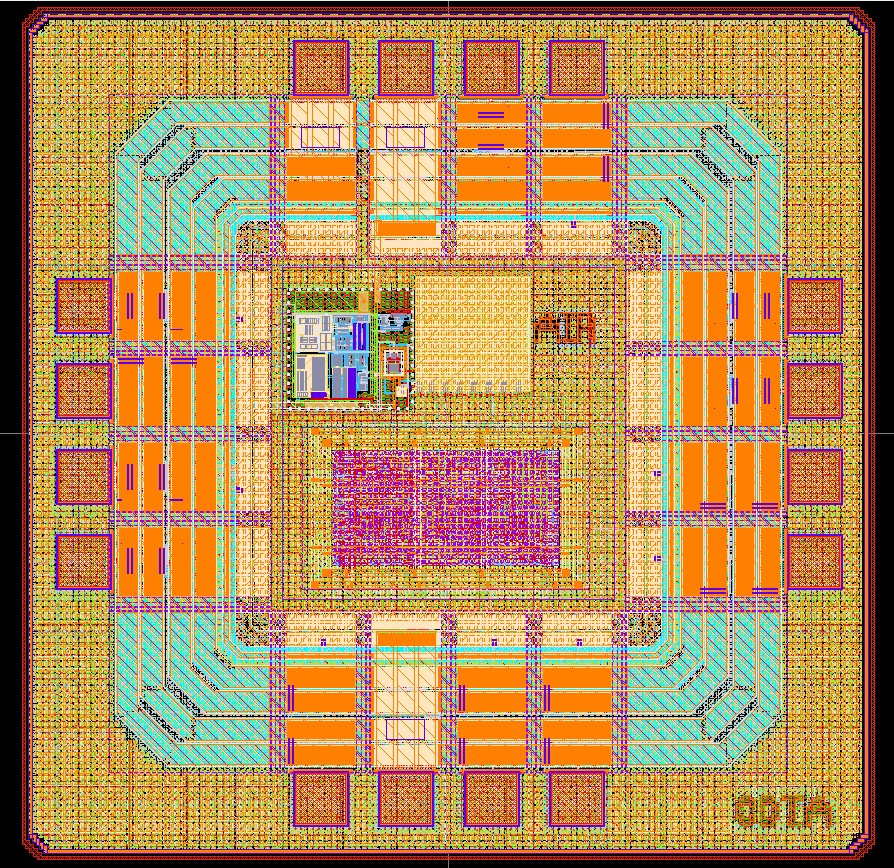

# SoC8767

Single-technology IP library.

- doc/     : user documentation
- dependencies/ : sub-cells and blocks
- release/v.1.0.0 : immutable versioned deliveries




| | |
|---|---|
| **Category** | Mixed-Signal SoC |
| **Technology** | IHP SG13CMOS |
| **Top Cell** | `SoC8767` |
| **Die Size** | 1 mm × 1 mm |
| **License** | Apache-2.0 |

---

## Overview

SoC8767 is a purpose-built SoC for combustible gas detection featuring SnO₂ sensitive material with high sensitivity to LPG, propane, and hydrogen across the 300-10000ppm range that uses a simple drive circuit for low-cost, long-life operation.


## Application

Our SoC is suited for a range of applications, including:
 - Home gas leak detectors – Alerts families to LPG or natural gas leaks in kitchens.
 - Industrial propane monitors – Warns workers of dangerous gas buildup in factories or warehouses.
 - Portable gas sniffers – Handheld devices for maintenance crews to check pipe connections.
 - Smart kitchen hoods – Automatically turns on exhaust fans when smoke or gas is detected.
 - Caravan and boat gas alarms – Compact safety devices for RVs to detect propane leaks in confined spaces.

### Features

 - Low Power Management — Digital FSM that intelligently controls power consumption for extended battery life in field deployments.
 - 8-bit SAR ADC — Built-in analog-to-digital converter for direct readout of the MQ-2 sensor's analog output.
 - I2C Interface — Standard communication protocol for easy integration with microcontrollers and data logging systems.
 - Integrated Clock — 8MHz VCO provides stable on-chip timing.
 - On-Chip Power Regulation — 1.2V LDO and 1V bandgap reference (BGR) for stable internal operation from a 3.3V external supply.
 - Digital Data Path & Control FSM — Complete digital core managing sensor readout, threshold comparison, and output generation.

---

### Prerequisites

- [IHP SG13G2 Open PDK](https://github.com/IHP-GmbH/IHP-Open-PDK)
- [LibreLane](https://github.com/efabless/librelane)
- [Icarus Verilog](http://iverilog.icarus.com/)

## License

Licensed under the [Apache License 2.0](https://www.apache.org/licenses/LICENSE-2.0).

```

Licensed under the Apache License, Version 2.0 (the "License");
you may not use this file except in compliance with the License.
You may obtain a copy of the License at

    http://www.apache.org/licenses/LICENSE-2.0
```
